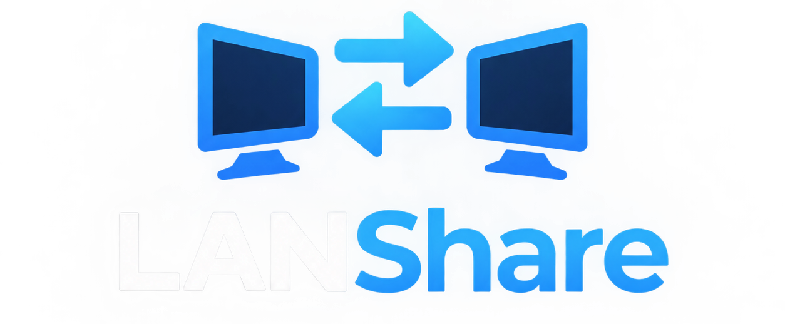

# LANShare

LANShare is a local network application designed to share a computer's screen and audio with other devices in real time.
The project is currently in early development, starting with the basic network connection between a Host and a Client.

> Screenshots will be added as the application develops.

---

## 📦 Instalation Guide

> Will be added as the application develops.

---

## 🛠️ Technologies

- **Python 3.11+**
- **Radmin VPN** — Virtual LAN connection
- **mss 10.1.0** — Screen Capture
- **dxcam-0.3.0** — High-performance screen capture
- **opencv-python 5.0.0** — Image and video processing
- **numpy 2.5.3** — Numerical and array processing
- **PySide6 6.9.0** — GUI

---

## 🐛 Known Issues

This project is currently in early development.

More information will be added as issues are discovered.

---

## 📋 Roadmap

### V0.1 — Connection

- [x] Create Host application
- [x] Create Client application
- [x] Allow the Client to enter the Host IP
- [x] Establish a connection
- [x] Detect disconnections

### V0.2 — Communication

- [x] Send messages between Host and Client
- [x] Add usernames
- [x] Implement a simple chat
- [x] Display connection status

### V0.3 — Screen Capture

- [x] Capture the Host's entire screen
- [x] Compress frames
- [x] Send frames to the Client
- [x] Display the screen on the Client
- [x] Target approximately 30 FPS

### V0.4 — Streaming

- [ ] Select which monitor to share
- [ ] Select which application to share
- [ ] Implement continuous streaming
- [ ] Reduce latency
- [ ] Control bitrate
- [ ] Adjust resolution
- [ ] Optimize CPU usage
- [ ] Optimize network bandwidth

### V0.5 — Audio

- [ ] Capture system audio
- [ ] Encode audio
- [ ] Transmit audio
- [ ] Synchronize audio and video
- [ ] Volume control

### V0.6 — Multiple Clients

- [ ] Support multiple viewers
- [ ] Display connected users

---

## 📋 License

This project is currently under development.