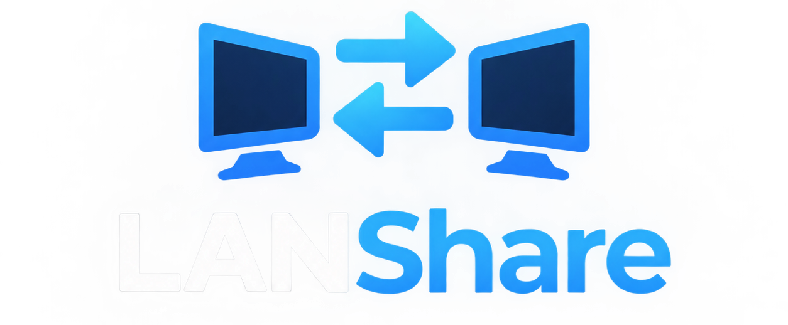

# LANShare

LANShare is a local network application designed to share a computer's screen with other devices in real time. It aims to provide low-latency screen streaming over a LAN connection, with support for multiple users, multiple monitors, and specific window sharing.

The project is being developed with performance, stability, and ease of use in mind, with future plans to include synchronized audio streaming and support for higher resolutions and frame rates.

> Screenshot will be added as the application develops.

---

## 📦 Instalation Guide

> Will be added as the application develops.

---

## 🛠️ How to use

> Will be added as the application develops.

---

## ⚙️ Technologies

- **Rust** — Core application, networking and system logic
- **C++** — Native Windows, DirectX and multimedia components
- **C#** — Desktop graphical user interface

---

## 🐛 Known Issues

*No known issues at the moment.*

---

## 🗺️ Roadmap

### V1.0
- [x] LAN connection
- [ ] 1080p / 30 FPS screen streaming
- [ ] Multiple users
- [ ] Host and Client GUI
- [ ] Multi-monitor selection with preview
- [ ] Specific window streaming
- [ ] Automatic updates

### Future Plans
- Audio streaming
- Audio/video synchronization
- Per-user volume control
- 4K / 60 FPS

---

## 📋 License

LANShare is released under the **MIT License**.

You are free to use, copy, modify, merge, publish, distribute, sublicense, and sell copies of the software, as long as the copyright notice and license text are included.

See the [LICENSE](LICENSE) file for the complete license terms.

---

## ☕💙 Support LANShare

LANShare is an open-source and free-to-use project. If you find LANShare useful and would like to support its development, consider sponsoring the project.

Your support helps with development, maintenance, testing, and future improvements.

